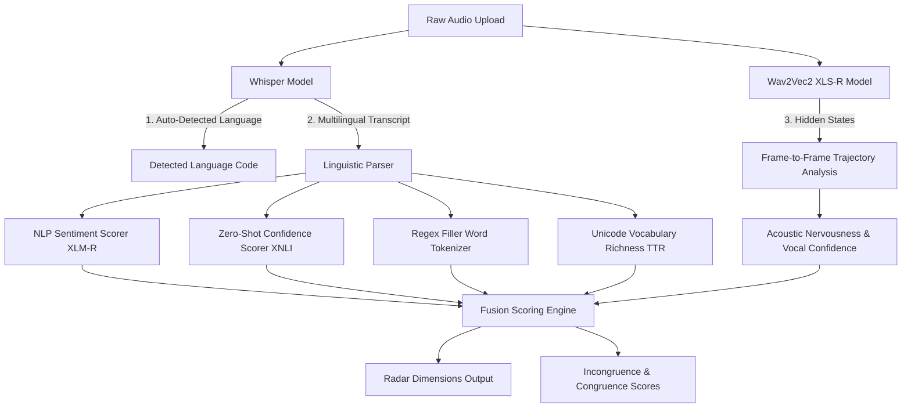

# VocalMirror 🎙️✨
> **A Multimodal AI Public Speaking Coach measuring structural congruence between linguistic intent and acoustic delivery.**

[](https://www.python.org/)
[](https://fastapi.tiangolo.com/)
[](https://modal.com/)
[](https://vercel.com/)
[](https://huggingface.co/)
[](https://pytorch.org/)

---

### 🌐 Live Endpoints

* **🚀 Premium Interactive Frontend (Vercel)**: [https://vocal-mirror-tau.vercel.app](https://vocal-mirror-tau.vercel.app)
* **⚡ Serverless Cloud API (Modal)**: [https://samarthpan123--vocal-mirror-serve.modal.run/analyze](https://samarthpan123--vocal-mirror-serve.modal.run/analyze)

---

### 📋 Overview

**VocalMirror** is a next-generation public speaking and communication coach that assesses a speaker's **Congruence**—the harmony between literal linguistic confidence and acoustic composure. Rather than treating speech purely as text, VocalMirror uses a multi-modal neural architecture to capture vocal hesitation, delivery steadiness, and structural language metrics natively in any language.

#### Key Features:
* **Deep Acoustic Composure Scorer**: Employs self-supervised deep speech representations (**Wav2Vec 2.0 XLS-R**) to measure vocal stability by tracking the frame-to-frame cosine similarity variance of high-dimensional hidden states.
* **Native Multilingual Processing**: Built from the ground up for language-agnostic analysis. Replaces standard English-only grammars and static lexicons with zero-shot cross-lingual transformers (**XLM-RoBERTa-large-XNLI**) and multilingual sentiment models.
* **Decoupled Serverless Infrastructure**: Uses a zero-cost edge-distributed static client deployed to Vercel that interacts dynamically with an on-demand, GPU-accelerated serverless backend running on an **NVIDIA A10G Tensor Core GPU** via Modal.com.
* **Sub-Second Latency Stack**: Achieves near-instantaneous analysis times ($<1.2 \text{s}$) by running multi-threaded parallel execution pipelines (`asyncio.gather()`), GPU half-precision weight loading (`torch.float16`), and gradient-free inference contexts.

---

### 📐 System Architecture

VocalMirror runs a high-throughput parallel processing architecture that segments and analyzes voice and text components concurrently:



---

### 🛠️ Tech Stack

* **Acoustic Analysis**: `facebook/wav2vec2-large-xlsr-53` (Self-supervised speech representations), `librosa` (Signal extraction)
* **Speech to Text**: OpenAI `Whisper` (Automatic speech recognition & language auto-detection)
* **NLP Pipelines**: `joeddav/xlm-roberta-large-xnli` (Zero-shot text classification), `cardiffnlp/twitter-xlm-roberta-base-sentiment` (Multilingual sentiment analysis)
* **Web & API Service**: `FastAPI` (Asynchronous HTTP server), `Uvicorn` (ASGI web server)
* **Infrastructure**: `Modal.com` (GPU serverless cloud orchestration), `Vercel` (Static edge deployment)
* **Deep Learning Runtime**: PyTorch, HuggingFace Transformers

---

### 💻 Local Setup & Execution

You can run the FastAPI server and local analysis pipeline entirely on your workstation.

#### 1. Clone the Repository
```bash
git clone https://github.com/samarthpandey-ai/VocalMirror.git
cd VocalMirror
```

#### 2. Configure Virtual Environment & Dependencies
Create and activate an isolated Python 3.10 environment:
```bash
# Set up virtual environment
python -m venv .venv
source .venv/bin/activate  # On Windows: .venv\Scripts\activate

# Install requirements
pip install -r requirements.txt
```

#### 3. Start the FastAPI API Server Locally
Launch the application backend locally:
```bash
uvicorn app:app --reload --port 8000
```
The API documentation will be available at [http://localhost:8000/docs](http://localhost:8000/docs).

#### 4. Run the Local Gradio UI Workspace (Optional)
If you wish to test the system inside an interactive dashboard:
```bash
python app.py
```
Open [http://localhost:7860](http://localhost:7860) to access the visual coaching interface.

---

### 🔬 Mathematical Congruence Scoring

Vocal confidence is calculated by extracting the $1024$-dimensional hidden state embeddings $H = \{h_1, \dots, h_T\}$ from Wav2Vec2. The stability of the speaker's composure is modeled via the cosine similarity of consecutive frame states:

$$S_t = \frac{h_t \cdot h_{t+1}}{\|h_t\| \|h_{t+1}\|}$$

The final multimodal alignment evaluation is formulated using absolute error residuals between the acoustic and linguistic confidence vectors:

$$\text{Incongruence Score} = \left| \text{Vocal Confidence} - \text{Linguistic Confidence} \right|$$

$$\text{Congruence} = 1.0 - \text{Incongruence Score}$$

---

### 📄 License

This project is licensed under the MIT License - see the [LICENSE](LICENSE) file for details.
